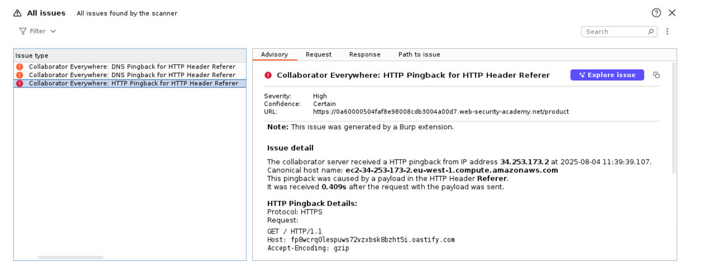
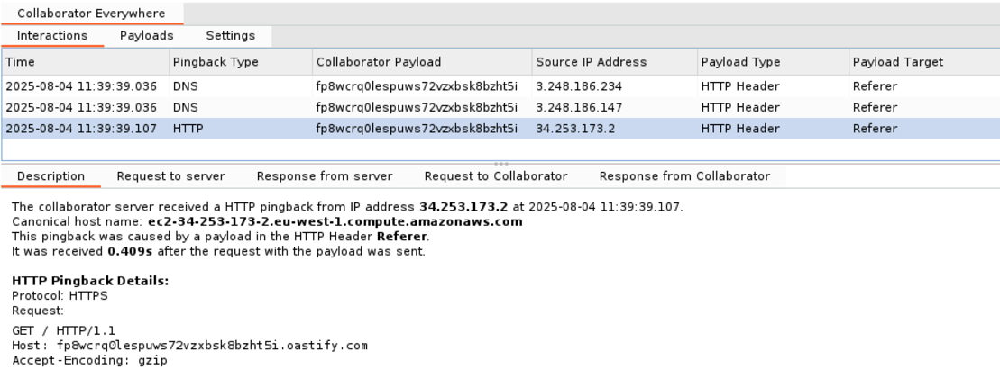
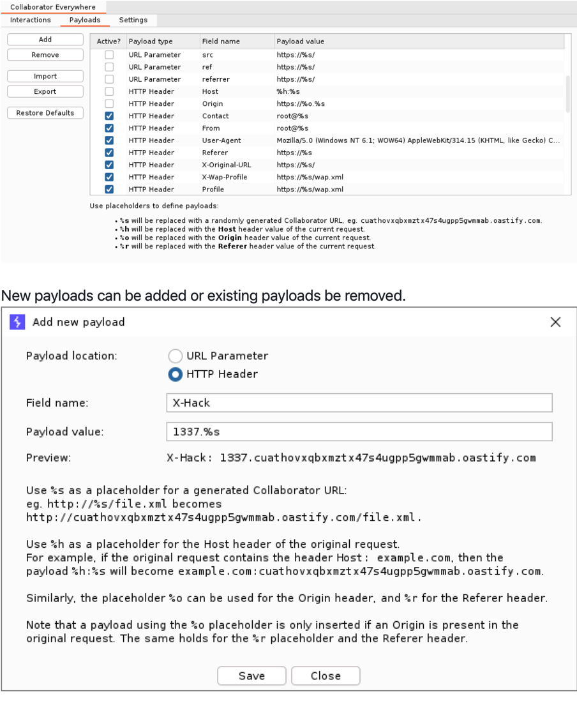

## Basics
- Ensure your Burp project has a Collaborator server configured (by default, Burp will use the public Collaborator 
server).
- Set your "Target → Scope". This limits where payloads are injected.
- Adjust your poll interval as necessary.
- When using a browser proxied through Burp, the extension will inject payloads into all headers and parameters of 
  in-scope requests, as specified by your "Payloads" tab.
- Monitor the "Interactions" table within the extension tab to analyze incoming responses from the Collaborator server.
- If an issue is raised:

- The Interactions tab shows all received pingbacks. When a row is selected, more details are shown below

- Payloads can be configured in the Payloads tab. They can be enabled or disabled though the checkbox, or edited by 
  double-clicking a cell.

## Refs
- https://github.com/portswigger/collaborator-everywhere-v2