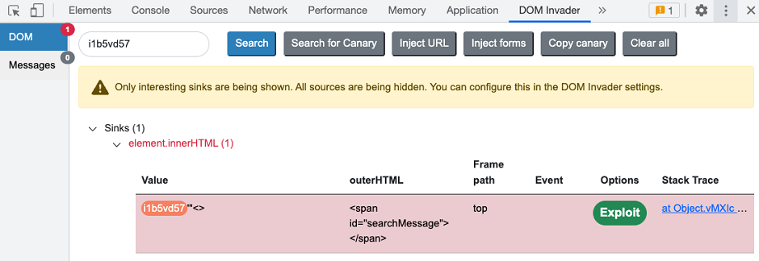
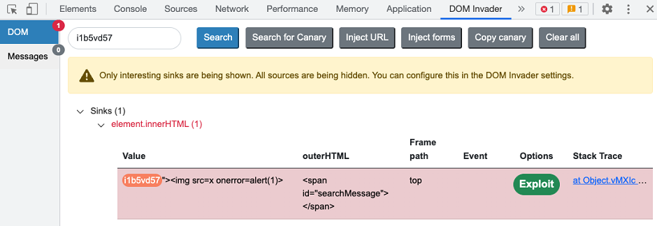
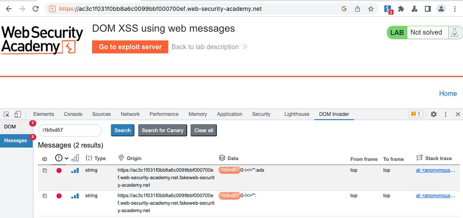
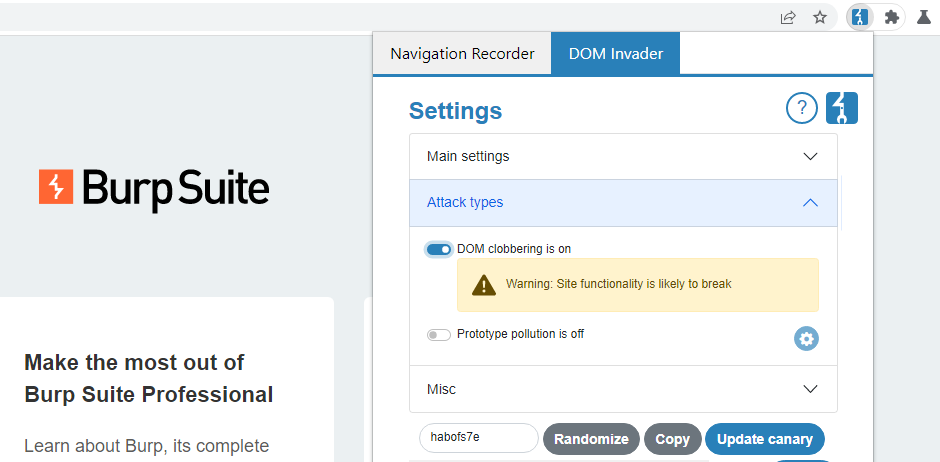

## Basics
Based on [hacktricks](https://hacktricks.wiki/en/pentesting-web/xss-cross-site-scripting/dom-invader.html) and [DOM 
Invader docs](https://portswigger.net/burp/documentation/desktop/tools/dom-invader)

### Enable
- Open **Proxy ➜ Intercept ➜ Open Browser** (Burp’s embedded browser).
- Click the Burp Suite logo (top-right). If it’s hidden, click the jigsaw-piece first.
- In DOM Invader tab, toggle Enable DOM Invader ON and press Reload.
- Open DevTools ( F12 / Right-click ➜ Inspect ) and dock it. A new DOM Invader panel appears.

### Testing for DOM XSS
#### Inject canary
- Go to the DOM Invader tab in the browser's DevTools panel.
- Make sure that you are in the DOM view.
- Click Copy canary. The canary that DOM Invader is tracking is copied to your clipboard.
- Paste the canary into any inputs that you want to test. This could be query parameters in the URL, form fields, and 
  so on.

Injecting a canary into multiple sources:
- Inject URL params - Automatically injects the canary into every query parameter in the URL, using a separate tab for each parameter. 
- Inject forms - Automatically injects the canary into any HTML form fields detected on the page. Note that you still need to submit the form manually for the injection to take effect.

#### Determining the XSS context
- DOM Invader displays the sink's contents, including both your canary and any surrounding characters that you inject 
as they appear in the DOM.
- you can append special characters to your canary in order to easily see whether they are being escaped or encoded

  - Outer HTML - The HTML element that surrounds your canary.
  - Frame path - The frame in which your canary is passed to the sink.
  - Event - The JavaScript event that occurs when your canary is passed to the sink.
- example with broken out of the double-quoted string and surrounding  in order to inject our XSS 
  proof-of-concept exploit:

### Web messages
- DOM Invader's Messages view:

- Go to the DOM Invader settings menu. 
- Select the Postmessage interception switch. 
- Click Reload to reload the browser. This is necessary for your changes to take effect.

#### Messages details
##### Origin
- If the client-side code never accesses the origin property of the message, it is likely that the origin is not 
  being validated --> you may be able to send cross-origin messages to the event handler from an arbitrary external 
  domain
- even messages in which the client-side code does access the origin property may still be insecure --> DOM Invader 
  provides a link to relevant line in the code via a stack trace --> study client-side code

##### Data
- The data property is the place for payload
- if JS doesn't access data prop --> no interest

##### Source
- source property of the message is a reference to the window object from which it was sent
- keep in mind that client-side code accessing this property does not guarantee that the source is being validated, 
  or that this validation cannot be bypassed

#### Replay messages
To send a modified web message:
- From the Messages view, click on any message to open the message details dialog.
- Edit the Data field as required.
- Click Send.

#### Generate PoC
To generate a proof of concept:
- Select the vulnerable message to open the message details dialog.
- Modify the values as required for your exploit.
- Click Build PoC. The HTML is saved to your clipboard.

### DOM clobbering
To enable DOM clobbering checks:
- Go to the DOM Invader settings menu.
- Under Attack types, toggle the switch so that DOM clobbering is on.
- Click Reload to refresh the browser. This is necessary for your changes to take effect.
- DOM Invader now scans for DOM clobbering vulnerabilities as you browse.

### Settings overview
DOM Invader is now split into Main / Attack Types / Misc / Canary categories.
- **Main**
  - Enable DOM Invader – global switch.
  - Postmessage interception – turn on/off message logging; sub-toggles for auto-mutation.
  - Custom Sources/Sinks – cog icon ➜ enable/disable specific sinks (e.g. eval, setAttribute) that may break the app.
- **Attack Types**
  - Prototype pollution (with per-technique settings).
  - DOM clobbering.
- **Misc**
  - Redirect prevention – block client-side redirects so the sink list isn’t lost.
  - Breakpoint before redirect – pause JS just before redirect for call-stack inspection.
  - Inject canary into all sources – auto-inject canary everywhere; configurable source/parameter allow-list.
- **Canary**
  - View / randomize / set custom canary; copy to clipboard. Changes require browser reload.

## Tips & Good Practices
- **Use distinct canary** – avoid common strings like test, otherwise false-positives occur.
- **Disable heavy sinks** (eval, innerHTML) temporarily if they break page functionality during navigation.
- **Combine with Burp Repeater & Proxy** – replicate the browser request/response that produced a vulnerable state and 
  craft final exploit URLs.
- **Remember frame scope** – sources/sinks are displayed per browsing context; vulnerabilities inside iframes might need 
  manual focus.
- **Export evidence** – right-click the DOM Invader panel ➜ Save screenshot to include in reports.