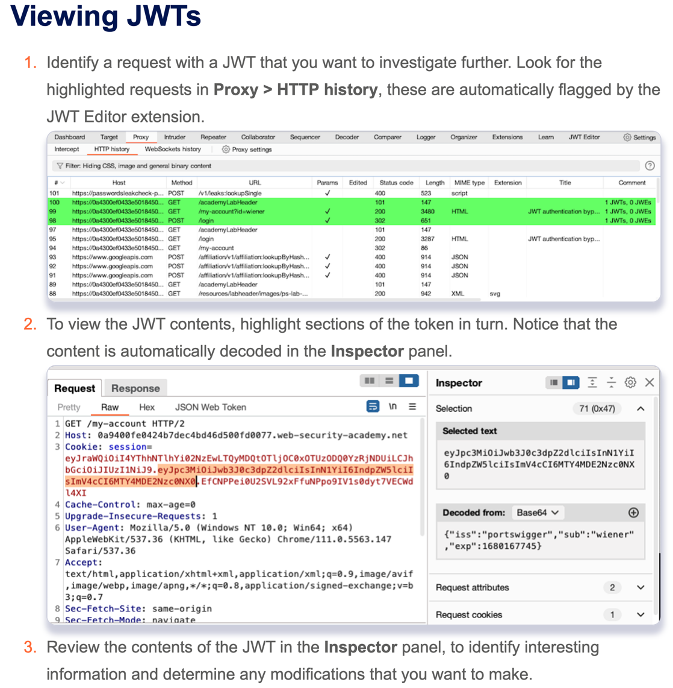

## Basics
- Install the JWT Editor extension from BApp Store.
- Identify a request with a JWT that you want to investigate further. Look for the highlighted requests in Proxy > 
  HTTP history, these are automatically flagged by the JWT Editor extension.
- To view the JWT contents, highlight sections of the token in turn. Notice that the content is automatically 
  decoded in the Inspector panel.
- To edit a JWT using the JWT Editor extension:
    - Right-click the request with the JWT and select Send to Repeater.
    - In the request panel, go to the JSON Web Token tab.
    - Edit the JSON data as required in the Header and Payload fields.
    - Click Sign. A new dialog opens.
    - In the dialog, select the appropriate signing key, then click OK. The JWT is re-signed to correspond with the 
      new values in the header and payload. If you haven't added a signing key, follow the instructions below.
- Add JWT key
    - Go to the JWT Editor Keys tab.
    - Click the button for the type of key that you want to add. For example, New Symmetric Key. A new dialog opens.
    - In the dialog, add the new key:
        - Click Generate to create a new key.
        - Alternatively, paste an existing key into the dialog.
    - Edit the key as required.
    - Click OK to save the key.
- JWK 
    - Generate a new RSA key. 
    - Send a request containing a JWT to Burp Repeater. 
    - In the message editor, switch to the extension-generated JSON Web Token tab and modify the token's payload 
      however you like. 
    - Click Attack, then select Embedded JWK. When prompted, select your newly generated RSA key. 
    - Send the request to test how the server responds.


## Brute JWT keys
```
hashcat -a 0 -m 16500 <jwt> <wordlist> --show
<jwt>:<identified-secret> --> hashcat outputs the identified secret in the following format
```
Wordlist is [here](https://github.com/wallarm/jwt-secrets/blob/master/jwt.secrets.list)

## RSA 2sign
This [tool](https://github.com/silentsignal/rsa_sign2n) might help to derive secret key from 2 JWTs.
```
docker run --rm -it portswigger/sig2n <token1> <token2>
```

## Refs
- https://portswigger.net/bappstore/26aaa5ded2f74beea19e2ed8345a93dd
- https://portswigger.net/burp/documentation/desktop/testing-workflow/vulnerabilities/session-management/jwts#adding-a-jwt-signing-key
- https://hashcat.net/wiki/doku.php?id=frequently_asked_questions#how_do_i_install_hashcat