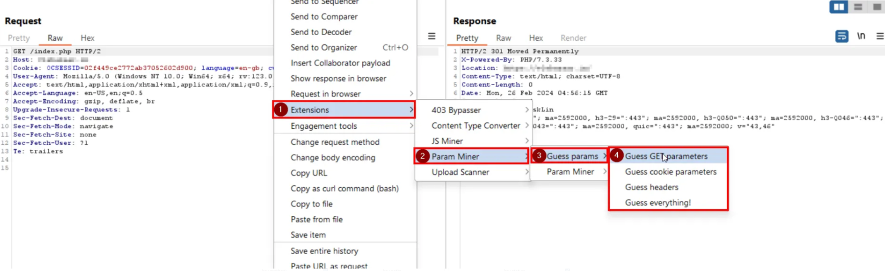
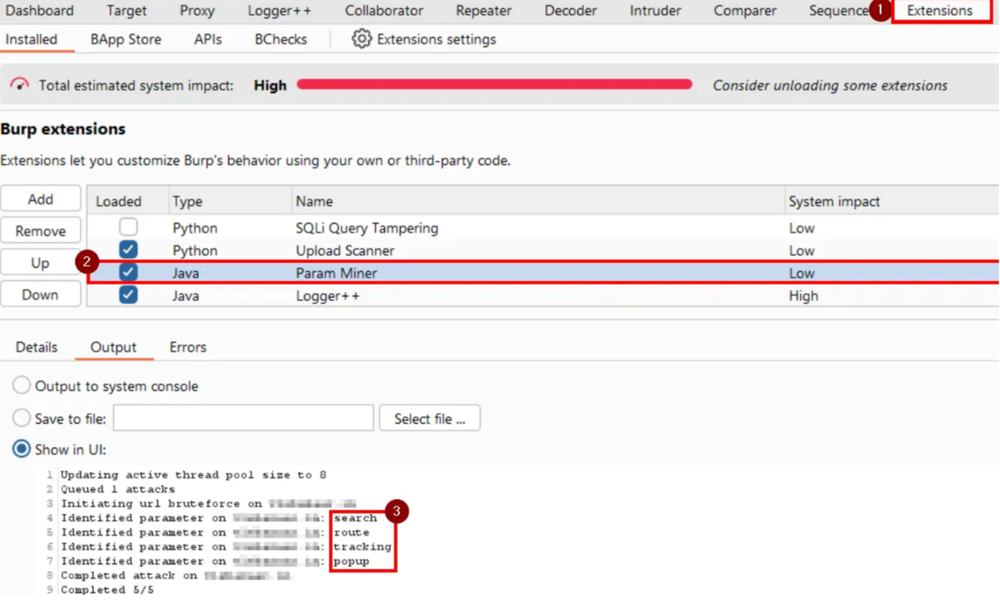

## Set up
- Install Burp Suite Pro (or Community)
- Go to Extender → BApp Store → Search and install Param Miner
- Enable it in the Target tab
- Right-click any request → Extensions → Guess Headers/Parameters

## Usage example
- There are 4 options: Guess GET parameters, Guess cookie parameters, Guess headers, and Guess everything

- on the next pop-up click OK or change some settings
- go to “Extensions” tab -> “Installed -> Param Miner -> Output”

## Overview from PortSwigger
To check for hidden inputs with Param Miner:
- In Burp Suite, open Target > Site map.
- Select the request you want to run Param Miner against. You can select multiple requests if required.
- Select Extensions > Param Miner > Guess params.
- Select the type of hidden inputs you want to Param Miner to guess:
  - Guess GET parameters
  - Guess cookie parameters
  - Guess headers
  - Guess everything!
- On the Attack Config dialog, click OK. If you selected Guess everything! you need to click OK a few times to close 
  the dialog. Param Miner sends a series of requests to the target.
- To view the results of the test, select Extensions > Installed > Param Miner > Output. This tab display a log of 
  Param Miner's run, including any hidden inputs identified.

## Refs
- https://medium.com/@kshahabaj528/mastering-param-miner-http-request-smuggling-a-bug-bounty-hunters-deep-dive-3304f3bbcdf5
- https://medium.com/fmisec/hunting-for-hidden-parameters-in-burp-suite-98b54616f863
- https://portswigger.net/burp/documentation/desktop/testing-workflow/analyzing/hidden-inputs