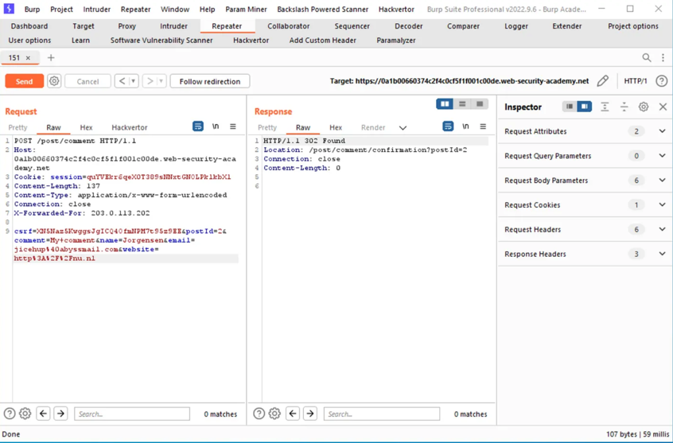
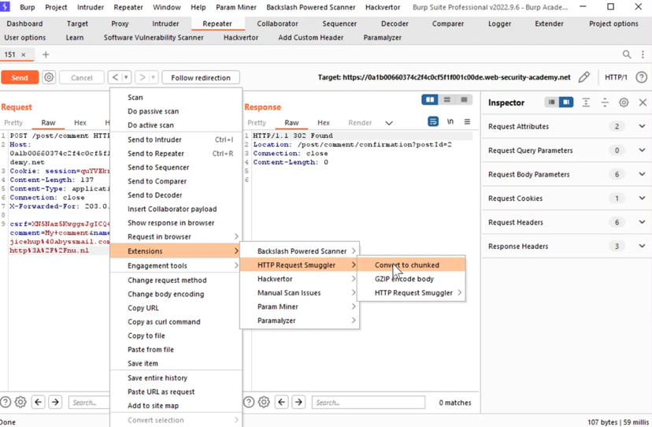
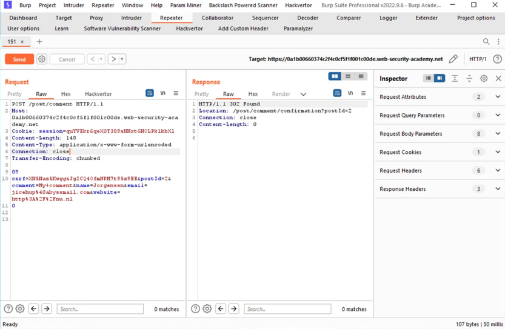
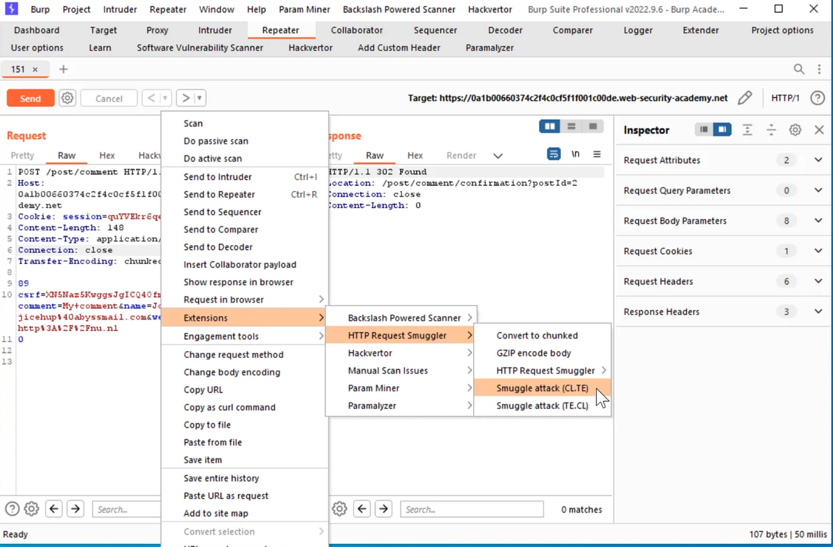
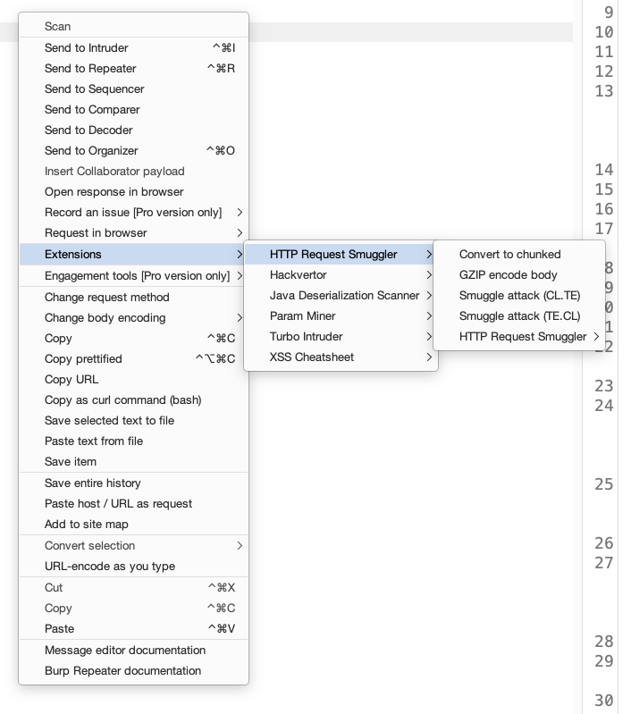
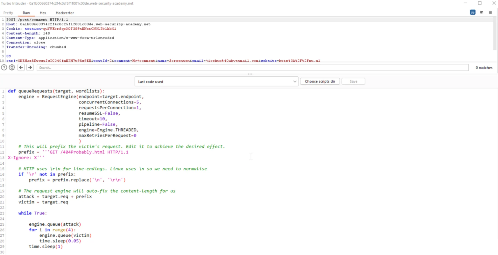
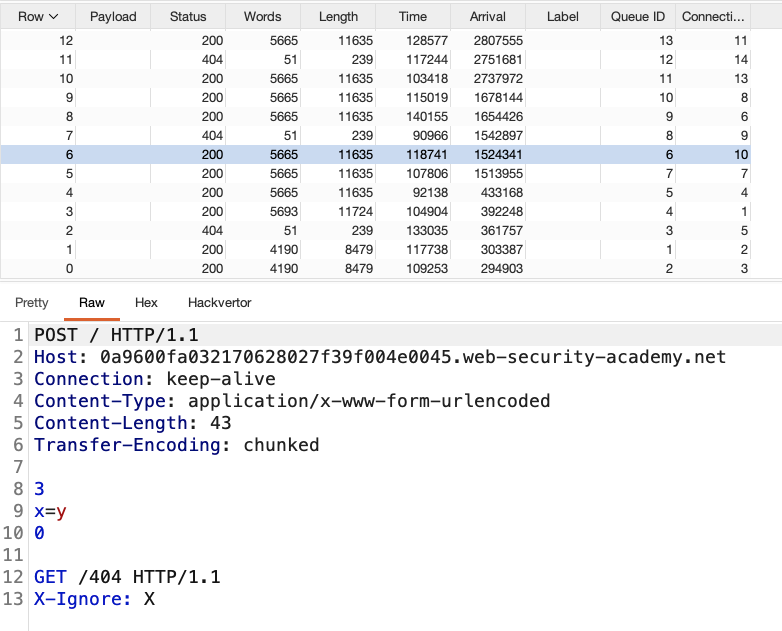

## Basics
How to use the tool to solve the first lab - HTTP request smuggling, basic CL.TE vulnerability:
1. Use the Extender->BApp store tab to install the 'HTTP Request Smuggler' extension.
2. Load the lab homepage, find the request in the proxy history, right click and select 'Launch smuggle probe', then 
click 'OK'. 
3. Wait for the probe to complete, indicated by 'Completed 1 of 1' appearing in the extension's output tab.
4. If you're using Burp Suite Pro, find the reported vulnerability in the dashboard and open the first attached request.
5. If you're using Burp Suite Community, copy the request from the output tab and paste it into the repeater, then 
complete the 'Target' details on the top right.
6. Right click on the request and select 'Smuggle attack (CL.TE)'.
7. Change the value of the 'prefix' variable to 'G', then click 'Attack' and confirm that one response says 
'Unrecognised method GPOST'.

## Step by step guied
Based on [Peter de Witte](https://peter-de-witte.medium.com/how-to-use-the-http-request-smuggler-extension-to-perform-an-attack-8a09c1a6801b) article:
- Send an unmodified and working post-request to the repeater. Test for a valid response.

- Select ‘Convert to chuncked’ in the extension-menu.

  - What actually happens is that the body is translated to chunked and the **Transfer-Encoding** header is added. The 
    **Content-Length** header keeps in place so the request specifies the length of the message body in a mixed way yet.
- Now there are two extra options available in the contextmenu, for the two types of request-smuggling attacks there 
  are. (CL.0 is not possible here). Choose the one that the request is vulnerable to.
- don't forget to use HTTP/1.1 if you need it

 
- This opens the Turbo intruder with yet a functional script in place for the attack in question.
- Change the prefix to achieve the desired effect. The prefix is the part of the body that is left on the stack and 
  that will appear as prefix on any subsequent request.

- Press ‘Attack’ and see a series of modified and unmodified requests appear in a table. Press ‘halt’ after a ten 
  responses or so. Press enter or click to view image in full size
- Now carefully study what happened. Selecting the rows in turn reveals this exactly! You can see how the resulting 
  requests look like, take note how the content-length has been changed by the script and that the connection is set 
  to keep-alive automatically for you.
- on the last screenshot notice that for every smuggled request we get 404 as expected (prefix: **GET /404 ...**)

- click ‘Configure’ to keep modifying the attack and repeat until the final result is achieved.

## Refs
- https://portswigger.net/research/http-desync-attacks-request-smuggling-reborn
- https://peter-de-witte.medium.com/how-to-use-the-http-request-smuggler-extension-to-perform-an-attack-8a09c1a6801b